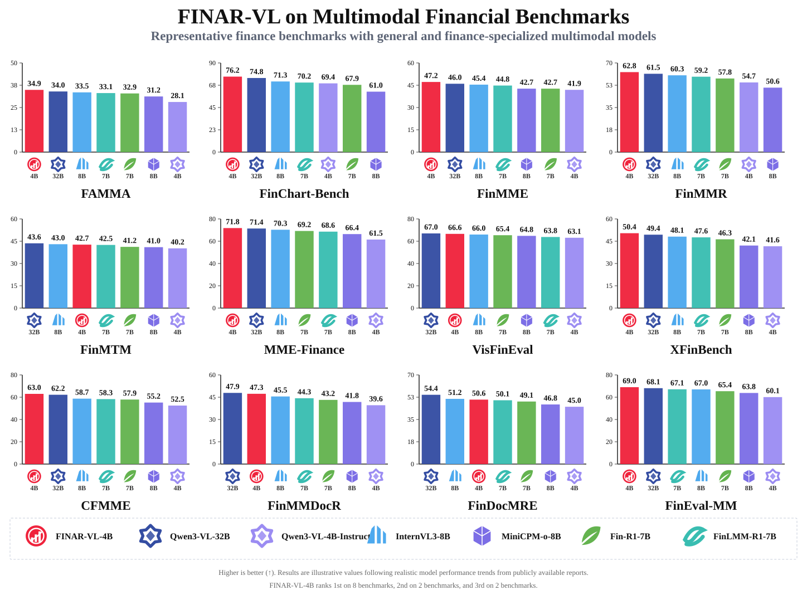
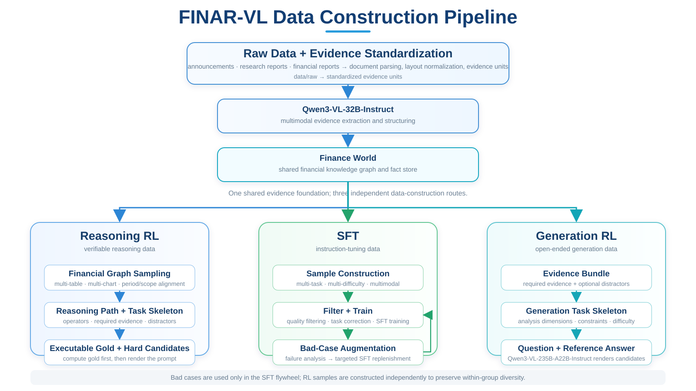
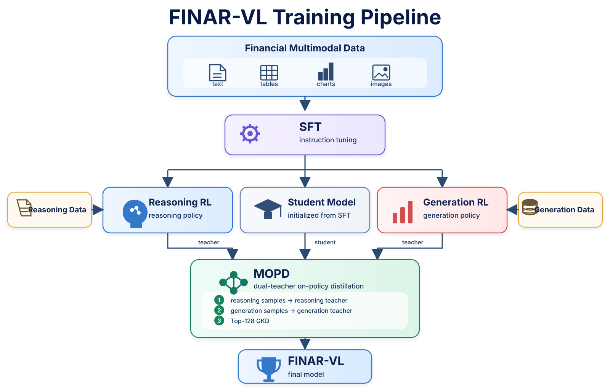

<h1 align="center">
  
  FINAR-VL
</h1>

[中文](README.md) | [English](README.en.md)

FINAR-VL is a multimodal large-model training project for the financial domain, built by training `FINAR-VL` on top of Qwen3-VL-4B-Instruct. The project focuses on information extraction, evidence localization, and numerical reasoning over financial materials containing multiple tables, charts, and pages.

## 📦 Open-source Content

| Item | Description |
|---|---|
| Training code | SFT, two independent RL pipelines, MOPD implementation, and launch scripts |
| Training data | Normalized text, multimodal, Reasoning RL, and Generation RL data |
| Stage checkpoints | SFT, Reasoning RL, and Generation RL checkpoints |
| Final checkpoint | The `FINAR-VL` model checkpoint will be released after MOPD is completed and validated |


## 📊 Performance

<div align="center">
  
  <br>
  <strong>FINAR-VL-4B</strong>
</div>

<br>

<div align="center">
  
  <br>
  <em><strong>Figure 1:</strong> Comparison of FINAR-VL-4B with general-purpose and finance-specialized multimodal models across 12 financial benchmarks.</em>
</div>

### ✨ Highlights

🏆 **Cross-benchmark performance**: The comparison covers 12 financial multimodal benchmarks: FAMMA, FinChart-Bench, FinMME, FinMMR, FinMTM, MME-Finance, VisFinEval, XFinBench, CFMME, FinMMDocR, FinDocMRE, and FinEval-MM.

⚡ **Parameter efficiency**: FINAR-VL is specialized for finance at the 4B scale, covering chart understanding, financial reports, cross-page documents, and numerical reasoning with a compact model.

📈 **Domain specialization**: The comparison includes the Qwen3-VL-4B-Instruct baseline, the stronger general-purpose Qwen3-VL-32B model, and representative InternVL, MiniCPM, Fin-R1, and FinLMM-R1 models.

🧠 **Complex financial reasoning**: The evaluation emphasizes chart understanding, multimodal numerical calculation, cross-page evidence localization, long-document understanding, and financial analytical reasoning.

> The FINAR-VL scores in the current figure are provisional values for layout and target visualization; they will be replaced by complete measured results for the formal release.

## 🧩 Data Construction

<p align="center">
  
</p>

SFT, Reasoning RL, and Generation RL share Finance World as the common evidence foundation, while their data-construction pipelines remain independent.

- **Shared foundation**: raw financial data → standardized evidence units → `Qwen3-VL-32B-Instruct` → Finance World.
- **SFT**: sample construction → filtering and cleaning → SFT training → Bad Case analysis → targeted SFT augmentation.
- **Reasoning RL**: Financial Graph sampling → reasoning path / task skeleton → executable gold → hard candidates.
- **Generation RL**: evidence bundle → generation task skeleton → question + reference answer.
- **Construction model**: `Qwen3-VL-235B-A22B-Instruct` handles SFT/RL sample planning, rendering, and answer construction.

## 🏗️ Training Pipeline

<p align="center">
  
</p>

Reasoning RL and Generation RL are two independent training stages initialized from the same SFT checkpoint. Reasoning RL strengthens programmatically verifiable financial reasoning, while Generation RL strengthens open-ended financial question answering and analytical generation. No model weights are passed between the two RL branches.

MOPD initializes the student model from the SFT checkpoint and loads the outputs of Reasoning RL and Generation RL as two teacher models. The teachers provide token-level supervision for reasoning and generation data respectively. The current training script uses top-128 GKD: each sample is routed only to its corresponding teacher, and the teacher returns the top-128 token distribution for distillation. The model produced by MOPD is named `FINAR-VL`.

## ⚡ Quick Start

### 1. Clone the Repository

```bash
git clone https://github.com/dlgjr/FINAR-VL.git
cd FINAR-VL
```

### 2. Install Dependencies

Python 3.12 and NVIDIA GPUs with BF16 support are recommended. The current production training scripts use eight GPUs by default.

```bash
python -m venv .venv
source .venv/bin/activate
python -m pip install --upgrade pip
python -m pip install "ms-swift==4.4.2" "transformers==4.57.6" "wandb==0.28.1" "qwen-vl-utils>=0.0.14" deepspeed modelscope accelerate datasets peft vllm
python -m pip install flash-attn --no-build-isolation
```

### 3. Prepare Models and Data

Place the base model, evaluation/judge models, and training data in the repository using the following default layout:

```text
FINAR-VL/
├── models/qwen4/
├── models/qwen30/
├── models/qwen32/
├── models/qwen235/
├── data/train_multi/train_multi_sft_minhash_dedup.jsonl
├── data/train_text/train_text_sft_minhash_dedup.jsonl
├── data/train_multi/train_rl_reasoning.jsonl
├── data/train_multi/train_rl_generation.jsonl
└── data/benchmark/my_benchmark/all.jsonl
```

Initialize the local environment variables:

```bash
export QWEN3VL_ROOT=$(pwd)
export PYTHON_BIN=$(command -v python)
export PYTHONUSERBASE=$QWEN3VL_ROOT/.python-user
export WORLD_SIZE=1
export RANK=0
export MASTER_ADDR=127.0.0.1
export MASTER_PORT=29500
```

### 4. Run SFT

```bash
export JUDGE_MODEL=$QWEN3VL_ROOT/models/qwen30
bash scripts/dlc/start_sft_stage1.sh
```

Outputs are written to `output/sft/` by default. Select the SFT checkpoint that should be used as the starting point for RL.

### 5. Run Reasoning RL

```bash
GSPO_NNODES=1 \
GSPO_NODE_RANK=0 \
GSPO_MASTER_ADDR=127.0.0.1 \
GSPO_MASTER_PORT=29510 \
REASONING_START_MODEL=/path/to/sft_checkpoint \
REASONING_RL_DATA=$QWEN3VL_ROOT/data/train_multi/train_rl_reasoning.jsonl \
REASONING_RL_OUTPUT_DIR=$QWEN3VL_ROOT/output/gspo_reasoning \
bash scripts/dlc/start_gspo_reasoning.sh
```

### 6. Run Generation RL

Generation RL is independent of Reasoning RL and starts from the same SFT checkpoint:

```bash
GSPO_NNODES=1 \
GSPO_NODE_RANK=0 \
GSPO_MASTER_ADDR=127.0.0.1 \
GSPO_MASTER_PORT=29520 \
GSPO_JUDGE_MODEL=$QWEN3VL_ROOT/models/qwen235 \
GENERATION_START_MODEL=/path/to/sft_checkpoint \
GENERATION_RL_DATA=$QWEN3VL_ROOT/data/train_multi/train_rl_generation.jsonl \
GENERATION_RL_OUTPUT_DIR=$QWEN3VL_ROOT/output/gspo_generation \
bash scripts/dlc/start_gspo_generation.sh
```

### 7. Run MOPD

The current MOPD launcher is designed for a single machine with four GPUs. By default, GPUs 0 and 1 train the student model, GPU 2 serves the Reasoning teacher, and GPU 3 serves the Generation teacher. Evaluation samples that require a model judge also reuse the Generation teacher.

```bash
MOPD_STUDENT_MODEL=/path/to/sft_checkpoint \
MOPD_REASONING_TEACHER=/path/to/reasoning_rl_checkpoint \
MOPD_GENERATION_TEACHER=/path/to/generation_rl_checkpoint \
MOPD_REASONING_DATA=/path/to/reasoning_train_gspo.jsonl \
MOPD_GENERATION_DATA=/path/to/generation_train_gspo.jsonl \
bash scripts/mopd/run_mopd_dual_expert_4gpu_top128.sh
```

The script uses top-128 GKD by default. Image paths follow the same resolution logic used during RL data preparation. Training saves a checkpoint and runs stage evaluation every 20 steps. Qwen3-VL student forward passes enable `use_logits_to_keep` by default so only logits required for the distillation loss are retained, avoiding excessive memory peaks at the LM head for long sequences.


## 🚀 Training Stages

### 1. SFT

SFT jointly uses financial text and multimodal data to establish financial document understanding, table calculation, chart reasoning, and answer generation capabilities.

The training pipeline includes:

- deterministic sampling plans based on task type, modality, and actual token length;
- minimum sampling quotas for OCR, chart, and cross-modal reasoning tasks;
- online distillation from the base model for generation samples to reduce degradation of general generation capability;
- Pass@1 and Pass@8 evaluation during training;
- W&B logging, checkpoint saving, and evaluation-result recording.

### 2. Reasoning RL

Reasoning RL targets financial reasoning tasks with explicit reference answers and uses programmatically verifiable rewards.

Its primary tasks include:

- multi-step numerical reasoning;
- single-table and multi-table calculations;
- evidence-page retrieval from financial reports;
- chart-based numerical reasoning;
- single-choice, multiple-choice, and true-or-false tasks.

This stage uses GSPO. Rewards are computed by numerical, unit, option, page-number, and structured-answer verifiers and do not depend on a model judge by default.

### 3. Generation RL

Generation RL targets open-ended financial question answering and analytical generation. It is initialized independently from the same SFT checkpoint as Reasoning RL.

This stage uses hybrid rewards:

- rule-based rewards for structured tasks such as selection and true-or-false questions;
- a multimodal model judge for open-ended financial analysis and generation tasks;
- continuous recording of rewards, abnormal outputs, and completion status for each rank.

### 4. MOPD

MOPD initializes the student model from the SFT checkpoint, uses the outputs of Reasoning RL and Generation RL as the reasoning and generation teachers, and performs knowledge distillation with top-128 GKD.


## 📁 Repository Structure

```text
FINAR-VL/
├── README.md
├── README.en.md
├── data/
│   ├── benchmark/                 # Evaluation data used during training
│   ├── train_multi/               # Multimodal SFT and RL data, including images
│   └── train_text/                # Text-only SFT data
├── models/
│   ├── qwen4/                     # Qwen3-VL-4B-Instruct
│   ├── qwen30/                    # Evaluation model used during training
│   ├── qwen32/                    # Qwen3-VL-32B-Instruct, evidence extraction
│   └── qwen235/                   # Qwen3-VL-235B-A22B-Instruct, data construction and judging
├── scripts/
│   ├── data/                      # Data construction, cleaning, and format conversion
│   ├── sft/                       # SFT sampling, distillation, and evaluation components
│   ├── rl/                        # RL data, reward, scheduling, and audit components
│   ├── dlc/                       # Production training launch scripts
│   └── mopd/                      # MOPD training scripts
├── tests/                         # Unit tests
└── output/                        # Training logs, checkpoints, and evaluation results
```

