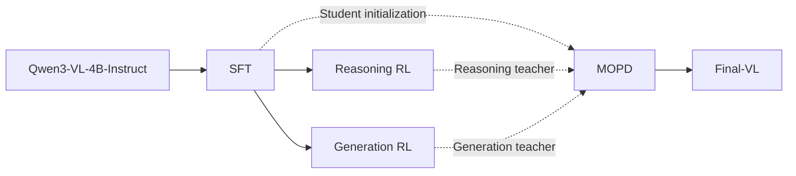

# FINAR-VL

[中文](README.md) | [English](README.en.md)

FINAR-VL is a financial-domain multimodal model training project that develops `Final-VL` from Qwen3-VL-4B-Instruct. It focuses on information extraction, evidence localization, and numerical reasoning over financial materials containing multiple tables, figures, and pages.

The SFT (Supervised Fine-Tuning) pipeline and two independent RL (Reinforcement Learning) pipelines are available. MOPD (Multi-teacher On-Policy Distillation) is still under development.

## Core Tasks

| Capability | Example tasks |
|---|---|
| Multi-table reasoning | Locate fields across tables, establish relationships, and perform joint calculations |
| Multi-image and cross-page reasoning | Retrieve evidence and answer questions using multiple charts, report pages, or attachments |
| Financial numerical reasoning | Ratios, growth rates, cumulative values, proportions, and multi-step arithmetic |
| Chart understanding | Data extraction, trend analysis, metric comparison, and chart-based calculations |
| Document understanding | Financial OCR, entity extraction, fact extraction, and evidence-page localization |
| Financial generation | Generate analytical answers from financial reports, market materials, and domain knowledge |

## Open-source Plan

| Item | Description |
|---|---|
| Training code | SFT, two independent RL pipelines, MOPD implementation, and launch scripts |
| Training data | Normalized text, multimodal, Reasoning RL, and Generation RL datasets |
| Stage checkpoints | SFT, Reasoning RL, and Generation RL model checkpoints |
| Final checkpoint | The `Final-VL` checkpoint will be released after MOPD is completed and validated |

## Training Pipeline



Reasoning RL and Generation RL are independent training stages initialized from the same SFT checkpoint. Reasoning RL improves programmatically verifiable financial reasoning, while Generation RL improves open-ended financial question answering and analytical generation. No model weights are passed between the two RL branches.

MOPD initializes the student from the SFT checkpoint and loads the outputs of Reasoning RL and Generation RL as two teacher models. The teachers provide token-level supervision for reasoning and generation data respectively. The resulting model is named `Final-VL`. This stage is not yet complete.

## Quick Start

### 1. Clone the Repository

```bash
git clone https://github.com/dlgjr/FINAR-VL.git
cd FINAR-VL
```

### 2. Install Dependencies

Python 3.12 and NVIDIA GPUs with BF16 support are recommended. The current production training scripts use eight GPUs by default.

```bash
python -m venv .venv
source .venv/bin/activate
python -m pip install --upgrade pip
python -m pip install "ms-swift==4.4.2" "transformers==4.57.6" "wandb==0.28.1" "qwen-vl-utils>=0.0.14" deepspeed modelscope accelerate datasets peft vllm
python -m pip install flash-attn --no-build-isolation
```

### 3. Prepare Models and Data

Place the base model, judge models, and training data in the repository using the following default layout:

```text
FINAR-VL/
├── models/qwen4/
├── models/qwen30/
├── models/qwen235/
├── data/train_multi/train_multi_sft_minhash_dedup.jsonl
├── data/train_text/train_text_sft_minhash_dedup.jsonl
├── data/train_multi/train_rl_reasoning.jsonl
├── data/train_multi/train_rl_generation.jsonl
└── data/benchmark/my_benchmark/all.jsonl
```

`models/qwen4` contains Qwen3-VL-4B-Instruct, `models/qwen30` is used for evaluation during training, and `models/qwen235` serves as the open-ended answer judge for Generation RL.

Set the local environment variables:

```bash
export QWEN3VL_ROOT=$(pwd)
export PYTHON_BIN=$(command -v python)
export PYTHONUSERBASE=$QWEN3VL_ROOT/.python-user
export WORLD_SIZE=1
export RANK=0
export MASTER_ADDR=127.0.0.1
export MASTER_PORT=29500
```

### 4. Run SFT

```bash
export JUDGE_MODEL=$QWEN3VL_ROOT/models/qwen30
bash scripts/dlc/start_sft_stage1.sh
```

Outputs are written to `output/sft/` by default. Select an SFT checkpoint from this directory as the starting point for both RL branches.

### 5. Run Reasoning RL

```bash
GSPO_NNODES=1 \
GSPO_NODE_RANK=0 \
GSPO_MASTER_ADDR=127.0.0.1 \
GSPO_MASTER_PORT=29510 \
REASONING_START_MODEL=/path/to/sft_checkpoint \
REASONING_RL_DATA=$QWEN3VL_ROOT/data/train_multi/train_rl_reasoning.jsonl \
REASONING_RL_OUTPUT_DIR=$QWEN3VL_ROOT/output/gspo_reasoning \
bash scripts/dlc/start_gspo_reasoning.sh
```

### 6. Run Generation RL

Generation RL is independent of Reasoning RL and starts from the same SFT checkpoint:

```bash
GSPO_NNODES=1 \
GSPO_NODE_RANK=0 \
GSPO_MASTER_ADDR=127.0.0.1 \
GSPO_MASTER_PORT=29520 \
GSPO_JUDGE_MODEL=$QWEN3VL_ROOT/models/qwen235 \
GENERATION_START_MODEL=/path/to/sft_checkpoint \
GENERATION_RL_DATA=$QWEN3VL_ROOT/data/train_multi/train_rl_generation.jsonl \
GENERATION_RL_OUTPUT_DIR=$QWEN3VL_ROOT/output/gspo_generation \
bash scripts/dlc/start_gspo_generation.sh
```

W&B logs, model checkpoints, evaluation results, reward audits, and per-rank status are saved under `output/` during training.

## Training Stages

### 1. SFT

SFT jointly uses financial text and multimodal data to establish financial document understanding, table calculation, chart reasoning, and answer generation capabilities.

The training pipeline includes:

- deterministic sampling plans based on task type, modality, and actual token length;
- minimum sampling quotas for OCR, chart, and cross-modal reasoning tasks;
- online distillation from the base model for generation samples to reduce general generation capability degradation;
- Pass@1 and Pass@8 evaluation during training;
- W&B logging, model checkpoint saving, and evaluation result saving.

### 2. Reasoning RL

Reasoning RL targets financial reasoning tasks with explicit reference answers and uses programmatically verifiable rewards.

Its primary tasks include:

- multi-step numerical reasoning;
- single-table and multi-table calculations;
- evidence-page retrieval from financial reports;
- chart-based numerical reasoning;
- single-choice, multiple-choice, and true-or-false tasks.

This stage uses GSPO (Group Sequence Policy Optimization). Rewards are computed by numerical, unit, option, page-number, and structured-answer verifiers and do not depend on a model judge by default.

### 3. Generation RL

Generation RL targets open-ended financial question answering and analytical generation. It is initialized from the same SFT checkpoint as Reasoning RL.

This stage uses hybrid rewards:

- rule-based rewards for structured tasks such as multiple-choice and true-or-false questions;
- a multimodal model judge for open-ended financial analysis and generation tasks;
- continuous records of rewards, abnormal outputs, and completion status for each rank.

### 4. MOPD (In Development)

MOPD initializes the student from the SFT checkpoint and uses the outputs of Reasoning RL and Generation RL as the reasoning and generation teachers. Each sample is routed to the corresponding teacher by dataset, and token-level KL supervision is applied for on-policy distillation. The resulting model is `Final-VL`. Only a launcher prototype is currently available; the training implementation and experimental results are incomplete, so no quick-start command is provided yet.

## RL Data and Reward Design

| Data branch | Main tasks | Reward method |
|---|---|---|
| Reasoning | Numerical calculation, table reasoning, evidence-page retrieval, and structured question answering | Programmatic rule-based rewards |
| Generation | Open-ended financial analysis, knowledge question answering, chart understanding, selection, and judgment tasks | Hybrid rule-based rewards and model judging |

Before RL training, the data pipeline performs the following steps:

1. Normalize the data schema and generate stable sample identifiers.
2. Validate questions, images, answers, and reward routing.
3. Estimate computation cost from image count and resolution, input length, generation length, and judge-call cost.
4. Split data into fine-grained tasks and balance the workload.
5. Record planned, completed, and remaining tasks, heartbeats, and errors during training.

## Data Format

Training data uses JSONL, with one independent sample per line.

### SFT Data

Multimodal and text-only SFT samples share the same schema. A text-only sample uses an empty `images` array. A multimodal sample places `<image>` markers in the user message and stores the corresponding image paths in the same order in `images`.

```json
{
  "messages": [
    {
      "role": "user",
      "content": "<image><image>Use the two financial report pages to complete the calculation."
    },
    {
      "role": "assistant",
      "content": "Calculation process and final answer"
    }
  ],
  "source": "dataset source",
  "split": "train",
  "images": [
    "assets/example/page_1.png",
    "assets/example/page_2.png"
  ],
  "task": "multi_step_numerical_reasoning"
}
```

Field definitions:

| Field | Description |
|---|---|
| `messages` | User input and supervised answer |
| `source` | Original dataset or document source |
| `split` | Data split; training data uses `train` |
| `images` | Relative image paths in the same order as the `<image>` markers |
| `task` | Task type used for sampling and capability statistics |

### RL Data

Reasoning RL and Generation RL use a common schema. Only the user message is retained as the training input, while the reference answer and reward configuration are stored as top-level fields.

```json
{
  "messages": [
    {
      "role": "user",
      "content": "<image>Calculate the year-over-year revenue growth shown in the chart."
    }
  ],
  "question": "<image>Calculate the year-over-year revenue growth shown in the chart.",
  "solution": "12.5%",
  "reward_type": "rule",
  "reward_subtype": "numeric",
  "source": "dataset source",
  "task": "multi_step_numerical_reasoning",
  "output_format": "number_or_free_text",
  "gold_option_text": "",
  "options_shuffled": false,
  "images": ["assets_rl/example/chart.png"],
  "verifier_type": "numeric",
  "_reward_routing": {
    "version": "finance_rl_route_v2",
    "reason": "declared_number_or_free_text",
    "source_line": 1
  }
}
```

Field definitions:

| Field | Description |
|---|---|
| `question` | Complete question passed to the model |
| `solution` | Reference answer for rule-based rewards; it may be empty for model-judge routes |
| `reward_type` | `rule` for rule-based rewards or `judge` for model judging |
| `reward_subtype` | Reward subtype such as numeric, single choice, multiple choice, true-or-false, page number, or free text |
| `output_format` | Expected output format |
| `verifier_type` | Answer verifier executed for the sample |
| `gold_option_text` | Text of the correct option for selection tasks |
| `options_shuffled` | Whether answer options were shuffled |
| `_reward_routing` | Reward-routing version, reason, and original line number |

## Repository Structure

```text
FINAR-VL/
├── README.md
├── README.en.md
├── data/
│   ├── benchmark/                 # Evaluation data used during training
│   ├── train_multi/               # Multimodal SFT and RL data, including images
│   └── train_text/                # Text-only SFT data
├── models/
│   ├── qwen4/                     # Qwen3-VL-4B-Instruct
│   ├── qwen30/                    # Evaluation model used during training
│   └── qwen235/                   # Judge model for Generation RL
├── scripts/
│   ├── data/                      # Data construction, cleaning, and format conversion
│   ├── sft/                       # SFT sampling, distillation, and evaluation components
│   ├── rl/                        # RL data, reward, scheduling, and audit components
│   ├── dlc/                       # Production training launch scripts
│   └── mopd/                      # MOPD training scripts
├── tests/                         # Unit tests
└── output/                        # Training logs, checkpoints, and evaluation results
```

## Production Training Scripts

| Script | Purpose |
|---|---|
| `scripts/dlc/start_sft_stage1.sh` | Production SFT entry point |
| `scripts/dlc/start_sft_reasoning_v2.sh` | SFT entry point configured for reasoning-capability retention |
| `scripts/dlc/start_sft.sh` | Main SFT pipeline for data preparation, sampling, training, evaluation, and saving |
| `scripts/dlc/start_gspo_reasoning.sh` | Reasoning RL launcher |
| `scripts/dlc/start_gspo_generation.sh` | Generation RL launcher |
| `scripts/dlc/start_gspo.sh` | Shared main pipeline for the two independent GSPO branches |
| `scripts/dlc/start_gspo_judge.sh` | Multimodal judge service for Generation RL |
| `scripts/dlc/gspo_env.sh` | GSPO distributed topology and training parameters |
| `scripts/dlc/gspo_reward_plugin.py` | Integration for rule-based and model-judge rewards |
| `scripts/dlc/gspo_trainer_plugin.py` | Training monitoring, reward auditing, and stage evaluation |
| `scripts/rl/prepare_gspo_data.py` | RL data conversion and computation-cost estimation |
| `scripts/rl/schedule_gspo_data.py` | Multi-GPU and multi-node workload balancing |
| `scripts/rl/validate_gspo_data.py` | RL data and reward-routing validation |
| `scripts/mopd/run_mopd.sh` | Incomplete MOPD training prototype |

