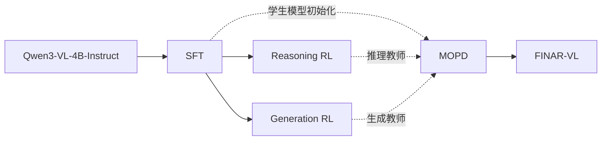

# FINAR-VL

[中文](README.md) | [English](README.en.md)

FINAR-VL 是一个面向金融领域的多模态大模型训练项目，基于 Qwen3-VL-4B-Instruct 训练 `FINAR-VL`。项目重点处理多表、多图、跨页金融材料中的信息提取、证据定位与数值计算问题。

当前已完成 SFT、两个独立的 RL训练链路，并接入 MOPD训练。

## 核心任务

| 能力 | 任务示例 |
|---|---|
| 多表推理 | 跨多个表格定位字段、建立字段关系并完成联合计算 |
| 多图与跨页推理 | 结合多个图表、财报页面或附件完成证据检索和问答 |
| 金融数值计算 | 比率、增减幅、累计值、占比和多步算术计算 |
| 图表理解 | 图表数据提取、趋势判断、指标比较和图表计算 |
| 文档理解 | 金融 OCR、实体抽取、事实抽取和证据页定位 |
| 金融生成 | 基于财报、市场材料和专业知识生成分析性回答 |

## 开源内容

| 内容 | 说明 |
|---|---|
| 训练代码 | 开源 SFT、两个独立 RL 和 MOPD 的训练实现与启动脚本 |
| 训练数据 | 开源规范化后的文本、多模态、Reasoning RL 和 Generation RL 数据 |
| 阶段权重 | 开源 SFT、Reasoning RL 和 Generation RL 的阶段模型权重 |
| 最终权重 | MOPD 完成并验证后开源 `FINAR-VL` 模型权重 |

## 技术路线



Reasoning RL 和 Generation RL 是两个独立训练阶段，均从同一个 SFT 检查点启动。Reasoning RL 强化可程序验证的金融推理能力；Generation RL 强化开放式金融问答和分析生成能力。两路 RL 之间不传递模型权重。

MOPD 以 SFT 检查点初始化学生模型，同时加载 Reasoning RL 和 Generation RL 的产出作为两个教师模型，根据 reasoning 和 generation 数据分别提供 token级教师信号。当前训练脚本使用 top-128 GKD：每个样本只路由到对应教师，由教师返回 top-128 token 分布进行蒸馏。MOPD 的产出模型命名为 `FINAR-VL`。

## 快速开始

### 1. 克隆仓库

```bash
git clone https://github.com/dlgjr/FINAR-VL.git
cd FINAR-VL
```

### 2. 安装依赖

建议使用 Python 3.12 和支持 BF16的 NVIDIA GPU。当前正式训练脚本默认使用 8 张 GPU。

```bash
python -m venv .venv
source .venv/bin/activate
python -m pip install --upgrade pip
python -m pip install "ms-swift==4.4.2" "transformers==4.57.6" "wandb==0.28.1" "qwen-vl-utils>=0.0.14" deepspeed modelscope accelerate datasets peft vllm
python -m pip install flash-attn --no-build-isolation
```

### 3. 准备模型和数据

将基础模型、裁判模型和训练数据放入仓库，默认目录结构如下：

```text
FINAR-VL/
├── models/qwen4/
├── models/qwen30/
├── models/qwen235/
├── data/train_multi/train_multi_sft_minhash_dedup.jsonl
├── data/train_text/train_text_sft_minhash_dedup.jsonl
├── data/train_multi/train_rl_reasoning.jsonl
├── data/train_multi/train_rl_generation.jsonl
└── data/benchmark/my_benchmark/all.jsonl
```

其中 `models/qwen4` 为 Qwen3-VL-4B-Instruct；`models/qwen30` 用于训练阶段评估；`models/qwen235` 用于 Generation RL 的开放式答案裁判。

初始化本机环境变量：

```bash
export QWEN3VL_ROOT=$(pwd)
export PYTHON_BIN=$(command -v python)
export PYTHONUSERBASE=$QWEN3VL_ROOT/.python-user
export WORLD_SIZE=1
export RANK=0
export MASTER_ADDR=127.0.0.1
export MASTER_PORT=29500
```

### 4. 运行 SFT

```bash
export JUDGE_MODEL=$QWEN3VL_ROOT/models/qwen30
bash scripts/dlc/start_sft_stage1.sh
```

训练结果默认写入 `output/sft/`。从该目录选择需要进入 RL 的 SFT 检查点。

### 5. 运行 Reasoning RL

```bash
GSPO_NNODES=1 \
GSPO_NODE_RANK=0 \
GSPO_MASTER_ADDR=127.0.0.1 \
GSPO_MASTER_PORT=29510 \
REASONING_START_MODEL=/path/to/sft_checkpoint \
REASONING_RL_DATA=$QWEN3VL_ROOT/data/train_multi/train_rl_reasoning.jsonl \
REASONING_RL_OUTPUT_DIR=$QWEN3VL_ROOT/output/gspo_reasoning \
bash scripts/dlc/start_gspo_reasoning.sh
```

### 6. 运行 Generation RL

Generation RL 与 Reasoning RL 独立，使用同一个 SFT 检查点作为起点：

```bash
GSPO_NNODES=1 \
GSPO_NODE_RANK=0 \
GSPO_MASTER_ADDR=127.0.0.1 \
GSPO_MASTER_PORT=29520 \
GSPO_JUDGE_MODEL=$QWEN3VL_ROOT/models/qwen235 \
GENERATION_START_MODEL=/path/to/sft_checkpoint \
GENERATION_RL_DATA=$QWEN3VL_ROOT/data/train_multi/train_rl_generation.jsonl \
GENERATION_RL_OUTPUT_DIR=$QWEN3VL_ROOT/output/gspo_generation \
bash scripts/dlc/start_gspo_generation.sh
```

### 7. 运行 MOPD

当前 MOPD 启动脚本按单机 4 卡设计。默认使用 GPU 0、1 训练学生模型，GPU 2 运行 Reasoning teacher，GPU 3 运行 Generation teacher；需要模型裁判的评估样本也复用 Generation teacher。

```bash
MOPD_STUDENT_MODEL=/path/to/sft_checkpoint \
MOPD_REASONING_TEACHER=/path/to/reasoning_rl_checkpoint \
MOPD_GENERATION_TEACHER=/path/to/generation_rl_checkpoint \
MOPD_REASONING_DATA=/path/to/reasoning_train_gspo.jsonl \
MOPD_GENERATION_DATA=/path/to/generation_train_gspo.jsonl \
bash scripts/mopd/run_mopd_dual_expert_4gpu_top128.sh
```

脚本默认使用 top-128 GKD，图片路径沿用 RL 数据准备阶段的解析逻辑。训练每 20 step 保存一次 checkpoint 并执行阶段评估；最新 checkpoint 保留完整 optimizer、scheduler、RNG 和 Trainer state，可以直接续训。Qwen3-VL 的学生前向默认开启 `use_logits_to_keep`，只保留需要计算蒸馏损失的 logits，避免长序列在 LM head 处产生过大的显存峰值。

常用参数可以通过环境变量覆盖：

```bash
export MOPD_GKD_TOPK=128
export MOPD_IMAGE_MAX_TOKEN_NUM=10240
export MOPD_PER_DEVICE_BATCH=2
export MOPD_GRAD_ACC=4
export MOPD_INTERVAL_STEPS=20
```

从 checkpoint 续训时，需要同时提供原 W&B run ID：

```bash
export WANDB_RUN_ID=<run_id>

bash scripts/mopd/run_mopd_dual_expert_4gpu_top128.sh \
  --resume_from_checkpoint /path/to/checkpoint-60
```

训练过程中生成的 W&B 日志、模型权重、评估结果、奖励审计和各 rank状态均保存在 `output/`。

## 训练阶段

### 1. SFT

SFT 阶段联合使用金融文本和多模态数据，建立金融文档理解、表格计算、图表推理和答案生成能力。

训练链路包含：

- 按任务类型、模态和实际 token长度生成确定性采样计划；
- 对 OCR、图表、跨模态推理等任务设置最低采样配额；
- 对生成类样本使用基础模型在线蒸馏，降低通用生成能力退化；
- 在训练过程中执行 Pass@1 和 Pass@8 评估；
- 记录 W&B日志、模型权重和评估结果。

### 2. Reasoning RL

Reasoning RL 路线面向具有明确标准答案的金融推理任务，使用程序化可验证奖励训练模型。

主要任务包括：

- 多步数值推理；
- 多表和单表计算；
- 财报证据页检索；
- 图表数值推理；
- 单选、多选和判断任务。

该阶段采用 GSPO，奖励由数值、单位、选项、页码及结构化答案校验器计算，默认不依赖模型裁判。

### 3. Generation RL

Generation RL 路线面向开放式金融问答和分析生成任务，与 Reasoning RL 分别从同一个 SFT 检查点启动。

该阶段使用混合奖励：

- 对选择题、判断题等结构化任务使用规则奖励；
- 对开放式金融分析和生成任务使用多模态模型裁判；
- 对奖励结果、异常输出和各 rank的完成状态进行持续记录。

### 4. MOPD

MOPD 阶段以 SFT 检查点作为学生模型，同时使用 Reasoning RL 和 Generation RL 的产出作为推理教师与生成教师。训练数据保持 reasoning 和 generation 两路等量，样本根据路由只请求对应教师。

当前实现使用 top-128 GKD。教师服务返回每个目标位置的 top-128 token 概率，学生模型据此计算蒸馏损失。Reasoning teacher 使用 Reasoning RL 训练时的回答格式，Generation teacher 使用 Generation RL 的回答格式，避免在蒸馏阶段混用两套策略提示词。

训练脚本同时复用 SFT 阶段的 Pass@1 / Pass@8 评估。能够程序判分的样本直接使用规则判分，确实需要模型裁判的样本交给 Generation teacher。checkpoint 每 20 step 保存一次，最新 checkpoint 保留完整训练状态，旧 checkpoint 只保留模型权重。

## RL 数据与奖励设计

| 数据路线 | 主要任务 | 奖励方式 |
|---|---|---|
| Reasoning | 数值计算、表格推理、证据页检索、结构化问答 | 程序化规则奖励 |
| Generation | 开放式金融分析、知识问答、图表理解、选择和判断任务 | 规则奖励与模型裁判混合 |

RL 数据进入训练前依次执行：

1. 统一数据结构并生成稳定样本标识；
2. 校验问题、图片、答案和奖励路由；
3. 根据图片数量与分辨率、输入长度、生成长度和裁判调用成本估计计算量；
4. 将数据拆分为细粒度任务并进行负载均衡；
5. 训练期间记录计划任务数、完成数、剩余数、心跳和错误状态。

## 目录结构

```text
FINAR-VL/
├── README.md
├── README.en.md
├── data/
│   ├── benchmark/                 # 训练期间评估数据
│   ├── train_multi/               # 多模态 SFT、RL 数据及图片
│   └── train_text/                # 纯文本 SFT 数据
├── models/
│   ├── qwen4/                     # Qwen3-VL-4B-Instruct
│   ├── qwen30/                    # 训练评估模型
│   └── qwen235/                   # Generation RL 裁判模型
├── scripts/
│   ├── data/                      # 数据构建、清洗和格式转换
│   ├── sft/                       # SFT 采样、蒸馏和评估组件
│   ├── rl/                        # RL 数据、奖励、调度和审计组件
│   ├── dlc/                       # 正式训练启动脚本
│   └── mopd/                      # MOPD 训练脚本
├── tests/                         # 单元测试
└── output/                        # 训练日志、权重和评估结果
```

## 正式训练脚本

| 脚本 | 作用 |
|---|---|
| `scripts/dlc/start_sft_stage1.sh` | SFT 正式训练入口 |
| `scripts/dlc/start_sft_reasoning_v2.sh` | SFT 推理能力保持配置入口 |
| `scripts/dlc/start_sft.sh` | SFT 数据准备、采样、训练、评估和保存主流程 |
| `scripts/dlc/start_gspo_reasoning.sh` | Reasoning RL 启动入口 |
| `scripts/dlc/start_gspo_generation.sh` | Generation RL 启动入口 |
| `scripts/dlc/start_gspo.sh` | 两个独立 GSPO 训练共用的主流程 |
| `scripts/dlc/start_gspo_judge.sh` | Generation RL 多模态裁判服务 |
| `scripts/dlc/gspo_env.sh` | GSPO 分布式拓扑和训练参数 |
| `scripts/dlc/gspo_reward_plugin.py` | 规则奖励与模型裁判奖励接入 |
| `scripts/dlc/gspo_trainer_plugin.py` | 训练监控、奖励审计和阶段评估 |
| `scripts/rl/prepare_gspo_data.py` | RL 数据转换和计算成本估计 |
| `scripts/rl/schedule_gspo_data.py` | 多卡、多节点负载均衡 |
| `scripts/rl/validate_gspo_data.py` | RL 数据和奖励路由校验 |
| `scripts/mopd/run_mopd_dual_expert_4gpu_top128.sh` | 单机 4 卡双教师 MOPD 训练入口，使用 top-128 GKD，并支持完整断点续训 |

