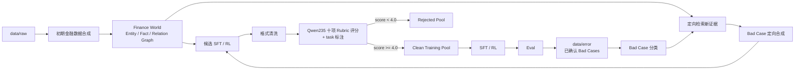
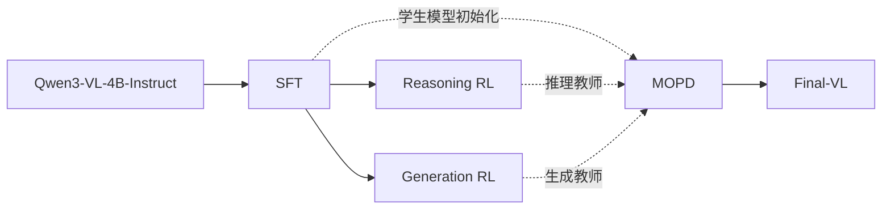

# FINAR-VL

[中文](README.md) | [English](README.en.md)

FINAR-VL 是一个面向金融领域的多模态大模型训练项目，基于 Qwen3-VL-4B-Instruct 训练 `Final-VL`。项目重点处理多表、多图、跨页金融材料中的信息提取、证据定位与数值计算问题。

当前已完成 SFT（监督微调）和两个独立的 RL（强化学习）训练链路；MOPD（Multi-teacher On-Policy Distillation，多教师在策略蒸馏）仍在开发中。

## 核心任务

| 能力 | 任务示例 |
|---|---|
| 多表推理 | 跨多个表格定位字段、建立字段关系并完成联合计算 |
| 多图与跨页推理 | 结合多个图表、财报页面或附件完成证据检索和问答 |
| 金融数值计算 | 比率、增减幅、累计值、占比和多步算术计算 |
| 图表理解 | 图表数据提取、趋势判断、指标比较和图表计算 |
| 文档理解 | 金融 OCR（光学字符识别）、实体抽取、事实抽取和证据页定位 |
| 金融生成 | 基于财报、市场材料和专业知识生成分析性回答 |

## 开源内容

| 内容 | 说明 |
|---|---|
| 训练代码 | 开源 SFT、两个独立 RL 和 MOPD 的训练实现与启动脚本 |
| 训练数据 | 开源规范化后的文本、多模态、Reasoning RL 和 Generation RL 数据 |
| 阶段权重 | 开源 SFT、Reasoning RL 和 Generation RL 的阶段模型权重 |
| 最终权重 | MOPD 完成并验证后开源 `Final-VL` 模型权重 |


## 数据构造、Bad Case 飞轮与筛选清洗

FINAR-VL 的训练数据不只做格式转换，而是使用“初期合成 → Bad Case 定向扩充 → 统一质量筛选”的数据闭环。Qwen3-VL-235B 负责金融语义、视觉理解和质量判断；Python 主要负责数据组织、格式检查、图结构检索和确定性流程控制。



### 1. 初期数据构造与合成

入口脚本为 `scripts/data/build_finance_sailorfog.py`。该脚本从 `data/raw` 构建金融证据世界，并使用本地 `model/qwen235` 生成训练样本。

主要步骤：

1. 将结构化文件、文本、PDF 页面和图片标准化为 evidence units；
2. 构建公司 / 文档实体，并抽取 period、market、document type 等信息；
3. 使用规则优先方式抽取数值 fact，再由 Qwen235 做语义归一和视觉事实抽取；
4. 基于 entity、fact、期间、财务关系、视觉关系等建立 relation graph；
5. 按任务约束从图中采样证据邻域，生成文本、多表、多图、跨页和跨模态 SFT / RL 样本；
6. 数值类样本保留可执行计算结构，并进行确定性计算校验；低可信 fact 进入 quarantine，不直接进入合成。

默认输出目录为 `data/synthetic/finance_world/`，其中包括 `evidence_units.jsonl`、`document_entities.jsonl`、`graph_facts.jsonl`、`graph_edges.jsonl` 和训练候选数据。

```bash
python scripts/data/build_finance_sailorfog.py --stage all --model model/qwen235 --tensor-parallel-size 8 --target 2000
```

### 2. Bad Case 数据飞轮

入口脚本为 `scripts/data/build_badcase_flywheel.py`。输入为 `data/error` 中已经确认的 Bad Case；脚本不会再次判断这些样本是否“真的错”，而是把原题、标准答案、模型错误输出和原始图片交给 Qwen235 做错误类型标注。

每条 Bad Case 被标注为：

- `task_type`：原问题主要考察的能力；
- `error_type`：模型主要错误类型，覆盖 OCR、表格、图表、K 线、检索、实体/期间/口径对齐、数值推理、知识、摘要、风险、政策、合规等；
- `scenario_tags`：年报、季报、公告、研报、利润表、现金流量表、多表、多图、跨页、跨模态等金融场景。

分类结果只用于决定下一批数据“补什么”。新训练题不会直接改写原 Bad Case，而是重新从 Finance World 检索新的真实证据。证据和图片按以下层级优先检索：

```text
同一 document
→ 同一 entity + 同一 period
→ 同一 entity + 相邻 period
→ 同一 entity + 其他 period
→ 仅在同行比较/行业分析等明确任务中扩展到同行业其他公司
```

视觉约束由 `task_type + error_type + scenario_tags` 联合决定。多表、多图、K 线和跨模态任务必须真实使用对应图片；普通 QA 默认尽量构造成视觉样本，同时保留一部分 text-only 数据。

```bash
python scripts/data/build_badcase_flywheel.py --error-root data/error --model model/qwen235 --backend vllm --tensor-parallel-size 8 --variants-per-case 6 --prefer-visual-ratio 0.8
```

### 3. 数据筛选、清洗与 task 标注

入口脚本为 `scripts/data/clean_synthetic_data.py`。清洗阶段刻意避免在 Python 中重新实现复杂金融语义判断：

1. Python 只删除 JSON、messages、监督答案、images 路径 / 图片文件等格式明显不合格的数据；
2. 其余样本全部交给 Qwen235 进行统一质量审核；
3. Qwen235 同时从 SFT 采样器的 task vocabulary 中选择一个 `task`，写回样本顶层 `task` 字段；原 task 保存在 `metadata.quality_filter.original_task`；
4. task 列表直接取自主分支 `scripts/sft/sample_plan_base.py` 的 `TASK_TO_FAMILY`，并包含 `scripts/sft/sample_plan.py` 中追加的 task；
5. 质量审核使用 10 条固定 rubric，每条只能为 `0` 或 `0.5`，满分 5 分；总分由 Python 重算，默认 `score >= 4.0` 才进入最终训练池。

| Rubric | 检查内容 |
|---|---|
| `answerability` | 材料是否足以唯一回答问题 |
| `answer_correctness` | 标准答案是否正确 |
| `evidence_grounding` | 关键结论是否均有证据支持 |
| `financial_alignment` | entity、period、metric、scope、unit、currency 等金融口径是否一致 |
| `reasoning_correctness` | 计算、比较、多跳、解释或因果逻辑是否成立 |
| `instruction_following` | 是否按问题要求的内容、粒度和格式作答 |
| `modality_grounding` | 图片 / 表格 / 图表是否真实参与任务，而非装饰 |
| `no_leakage_or_shortcut` | 是否存在答案泄漏或绕过目标能力的捷径 |
| `training_value` | 是否具有明确、自然的训练价值 |
| `clarity_and_integrity` | 数据是否清楚、完整、内部一致 |

每条 rubric 独立给分，LLM 不负责计算总分。低于 4 分的数据写入 rejected pool，同时保留每个失败维度，便于分析合成数据的主要质量问题。

```bash
python scripts/data/clean_synthetic_data.py --input data/synthetic/finance_world/train_sft.jsonl --input data/synthetic/badcase_flywheel/train_sft_badcase.jsonl --model model/qwen235 --backend vllm --tensor-parallel-size 8 --threshold 4.0
```

默认清洗输出：

```text
data/synthetic/cleaned/
├── accepted.jsonl
├── rejected_low_score.jsonl
├── rejected_format.jsonl
├── judge_failures.jsonl
└── report.json
```

## 技术路线



Reasoning RL 和 Generation RL 是两个独立训练阶段，均从同一个 SFT 检查点启动。Reasoning RL 强化可程序验证的金融推理能力；Generation RL 强化开放式金融问答和分析生成能力。两路 RL 之间不传递模型权重。

MOPD 以 SFT 检查点初始化学生模型，同时加载 Reasoning RL 和 Generation RL 的产出作为两个教师模型，根据 reasoning 和 generation 数据分别提供 token（词元）级教师信号。MOPD 的产出模型命名为 `Final-VL`。目前该阶段尚未完成。

## 快速开始

### 1. 克隆仓库

```bash
git clone https://github.com/dlgjr/FINAR-VL.git
cd FINAR-VL
```

### 2. 安装依赖

建议使用 Python 3.12 和支持 BF16（脑浮点格式）的 NVIDIA GPU。当前正式训练脚本默认使用 8 张 GPU。

```bash
python -m venv .venv
source .venv/bin/activate
python -m pip install --upgrade pip
python -m pip install "ms-swift==4.4.2" "transformers==4.57.6" "wandb==0.28.1" "qwen-vl-utils>=0.0.14" deepspeed modelscope accelerate datasets peft vllm
python -m pip install flash-attn --no-build-isolation
```

### 3. 准备模型和数据

将基础模型、裁判模型和训练数据放入仓库，默认目录结构如下：

```text
FINAR-VL/
├── models/qwen4/
├── models/qwen30/
├── models/qwen235/
├── data/train_multi/train_multi_sft_minhash_dedup.jsonl
├── data/train_text/train_text_sft_minhash_dedup.jsonl
├── data/train_multi/train_rl_reasoning.jsonl
├── data/train_multi/train_rl_generation.jsonl
└── data/benchmark/my_benchmark/all.jsonl
```

其中 `models/qwen4` 为 Qwen3-VL-4B-Instruct；`models/qwen30` 用于训练阶段评估；`models/qwen235` 用于 Generation RL 的开放式答案裁判。

初始化本机环境变量：

```bash
export QWEN3VL_ROOT=$(pwd)
export PYTHON_BIN=$(command -v python)
export PYTHONUSERBASE=$QWEN3VL_ROOT/.python-user
export WORLD_SIZE=1
export RANK=0
export MASTER_ADDR=127.0.0.1
export MASTER_PORT=29500
```

### 4. 运行 SFT

```bash
export JUDGE_MODEL=$QWEN3VL_ROOT/models/qwen30
bash scripts/dlc/start_sft_stage1.sh
```

训练结果默认写入 `output/sft/`。从该目录选择需要进入 RL 的 SFT 检查点。

### 5. 运行 Reasoning RL

```bash
GSPO_NNODES=1 \
GSPO_NODE_RANK=0 \
GSPO_MASTER_ADDR=127.0.0.1 \
GSPO_MASTER_PORT=29510 \
REASONING_START_MODEL=/path/to/sft_checkpoint \
REASONING_RL_DATA=$QWEN3VL_ROOT/data/train_multi/train_rl_reasoning.jsonl \
REASONING_RL_OUTPUT_DIR=$QWEN3VL_ROOT/output/gspo_reasoning \
bash scripts/dlc/start_gspo_reasoning.sh
```

### 6. 运行 Generation RL

Generation RL 与 Reasoning RL 独立，使用同一个 SFT 检查点作为起点：

```bash
GSPO_NNODES=1 \
GSPO_NODE_RANK=0 \
GSPO_MASTER_ADDR=127.0.0.1 \
GSPO_MASTER_PORT=29520 \
GSPO_JUDGE_MODEL=$QWEN3VL_ROOT/models/qwen235 \
GENERATION_START_MODEL=/path/to/sft_checkpoint \
GENERATION_RL_DATA=$QWEN3VL_ROOT/data/train_multi/train_rl_generation.jsonl \
GENERATION_RL_OUTPUT_DIR=$QWEN3VL_ROOT/output/gspo_generation \
bash scripts/dlc/start_gspo_generation.sh
```

训练过程中生成的 W&B 日志、模型权重、评估结果、奖励审计和各 rank（训练进程）状态均保存在 `output/`。

## 训练阶段

### 1. SFT（监督微调）

SFT 阶段联合使用金融文本和多模态数据，建立金融文档理解、表格计算、图表推理和答案生成能力。

训练链路包含：

- 按任务类型、模态和实际 token（词元）长度生成确定性采样计划；
- 对 OCR、图表、跨模态推理等任务设置最低采样配额；
- 对生成类样本使用基础模型在线蒸馏，降低通用生成能力退化；
- 在训练过程中执行 Pass@1 和 Pass@8 评估；
- 记录 W&B（实验跟踪）日志、模型权重和评估结果。

### 2. Reasoning RL（推理强化学习）

Reasoning RL 路线面向具有明确标准答案的金融推理任务，使用程序化可验证奖励训练模型。

主要任务包括：

- 多步数值推理；
- 多表和单表计算；
- 财报证据页检索；
- 图表数值推理；
- 单选、多选和判断任务。

该阶段采用 GSPO（组序列策略优化），奖励由数值、单位、选项、页码及结构化答案校验器计算，默认不依赖模型裁判。

### 3. Generation RL（生成强化学习）

Generation RL 路线面向开放式金融问答和分析生成任务，与 Reasoning RL 分别从同一个 SFT 检查点启动。

该阶段使用混合奖励：

- 对选择题、判断题等结构化任务使用规则奖励；
- 对开放式金融分析和生成任务使用多模态模型裁判；
- 对奖励结果、异常输出和各 rank（训练进程）的完成状态进行持续记录。

### 4. MOPD（开发中）

MOPD 阶段以 SFT 检查点作为学生模型，同时使用 Reasoning RL 和 Generation RL 的产出作为推理教师与生成教师。训练时根据样本所属数据集选择对应教师，通过 token 级 KL（相对熵）信号进行在策略蒸馏，最终产出 `Final-VL`。当前只有启动脚本原型，训练实现和实验结论尚未完成，因此暂不提供快速开始命令。

## RL 数据与奖励设计

| 数据路线 | 主要任务 | 奖励方式 |
|---|---|---|
| Reasoning | 数值计算、表格推理、证据页检索、结构化问答 | 程序化规则奖励 |
| Generation | 开放式金融分析、知识问答、图表理解、选择和判断任务 | 规则奖励与模型裁判混合 |

RL 数据进入训练前依次执行：

1. 统一数据结构并生成稳定样本标识；
2. 校验问题、图片、答案和奖励路由；
3. 根据图片数量与分辨率、输入长度、生成长度和裁判调用成本估计计算量；
4. 将数据拆分为细粒度任务并进行负载均衡；
5. 训练期间记录计划任务数、完成数、剩余数、心跳和错误状态。

## 数据格式

训练数据使用 JSONL 格式，每行保存一条独立样本。

### SFT 数据

多模态和纯文本 SFT 数据使用同一结构。纯文本样本的 `images` 为空数组；多模态样本在用户消息中使用 `<image>` 标记，并在 `images` 中按出现顺序保存对应图片路径。

```json
{
  "messages": [
    {
      "role": "user",
      "content": "<image><image>请结合两页财报完成计算。"
    },
    {
      "role": "assistant",
      "content": "计算过程与最终答案"
    }
  ],
  "source": "数据来源",
  "split": "train",
  "images": [
    "assets/example/page_1.png",
    "assets/example/page_2.png"
  ],
  "task": "multi_step_numerical_reasoning"
}
```

字段说明：

| 字段 | 含义 |
|---|---|
| `messages` | 用户输入和监督答案 |
| `source` | 原始数据集或文档来源 |
| `split` | 数据划分，训练数据使用 `train` |
| `images` | 图片相对路径，顺序与 `<image>` 标记一致 |
| `task` | 任务类型，用于采样和能力统计 |

### RL 数据

Reasoning RL 和 Generation RL 使用统一结构。训练输入只保留用户消息，标准答案和奖励配置存放在顶层字段中。

```json
{
  "messages": [
    {
      "role": "user",
      "content": "<image>根据图表计算营业收入同比增幅。"
    }
  ],
  "question": "<image>根据图表计算营业收入同比增幅。",
  "solution": "12.5%",
  "reward_type": "rule",
  "reward_subtype": "numeric",
  "source": "数据来源",
  "task": "multi_step_numerical_reasoning",
  "output_format": "number_or_free_text",
  "gold_option_text": "",
  "options_shuffled": false,
  "images": ["assets_rl/example/chart.png"],
  "verifier_type": "numeric",
  "_reward_routing": {
    "version": "finance_rl_route_v2",
    "reason": "declared_number_or_free_text",
    "source_line": 1
  }
}
```

字段说明：

| 字段 | 含义 |
|---|---|
| `question` | 进入模型的完整问题 |
| `solution` | 规则奖励使用的标准答案；模型裁判路线可为空 |
| `reward_type` | `rule` 表示规则奖励，`judge` 表示模型裁判 |
| `reward_subtype` | 数值、单选、多选、判断、页码或自由文本等奖励子类型 |
| `output_format` | 期望输出格式 |
| `verifier_type` | 实际执行的答案校验器 |
| `gold_option_text` | 选择题正确选项的文本内容 |
| `options_shuffled` | 选项是否经过重排 |
| `_reward_routing` | 奖励路由版本、原因和原始行号 |

## 目录结构

```text
FINAR-VL/
├── README.md
├── README.en.md
├── data/
│   ├── benchmark/                 # 训练期间评估数据
│   ├── error/                     # 评测产生的已确认 Bad Cases
│   ├── synthetic/                 # 初期合成、飞轮候选和清洗结果
│   ├── train_multi/               # 多模态 SFT、RL 数据及图片
│   └── train_text/                # 纯文本 SFT 数据
├── models/
│   ├── qwen4/                     # Qwen3-VL-4B-Instruct
│   ├── qwen30/                    # 训练评估模型
│   └── qwen235/                   # Generation RL 裁判模型
├── scripts/
│   ├── data/                      # 数据构建、清洗和格式转换
│   ├── sft/                       # SFT 采样、蒸馏和评估组件
│   ├── rl/                        # RL 数据、奖励、调度和审计组件
│   ├── dlc/                       # 正式训练启动脚本
│   └── mopd/                      # MOPD 训练脚本
├── tests/                         # 单元测试
└── output/                        # 训练日志、权重和评估结果
```

## 正式训练脚本

| 脚本 | 作用 |
|---|---|
| `scripts/dlc/start_sft_stage1.sh` | SFT 正式训练入口 |
| `scripts/dlc/start_sft_reasoning_v2.sh` | SFT 推理能力保持配置入口 |
| `scripts/dlc/start_sft.sh` | SFT 数据准备、采样、训练、评估和保存主流程 |
| `scripts/dlc/start_gspo_reasoning.sh` | Reasoning RL 启动入口 |
| `scripts/dlc/start_gspo_generation.sh` | Generation RL 启动入口 |
| `scripts/dlc/start_gspo.sh` | 两个独立 GSPO 训练共用的主流程 |
| `scripts/dlc/start_gspo_judge.sh` | Generation RL 多模态裁判服务 |
| `scripts/dlc/gspo_env.sh` | GSPO 分布式拓扑和训练参数 |
| `scripts/dlc/gspo_reward_plugin.py` | 规则奖励与模型裁判奖励接入 |
| `scripts/dlc/gspo_trainer_plugin.py` | 训练监控、奖励审计和阶段评估 |
| `scripts/rl/prepare_gspo_data.py` | RL 数据转换和计算成本估计 |
| `scripts/rl/schedule_gspo_data.py` | 多卡、多节点负载均衡 |
| `scripts/rl/validate_gspo_data.py` | RL 数据和奖励路由校验 |
| `scripts/mopd/run_mopd.sh` | MOPD 训练原型，尚未完成 |

